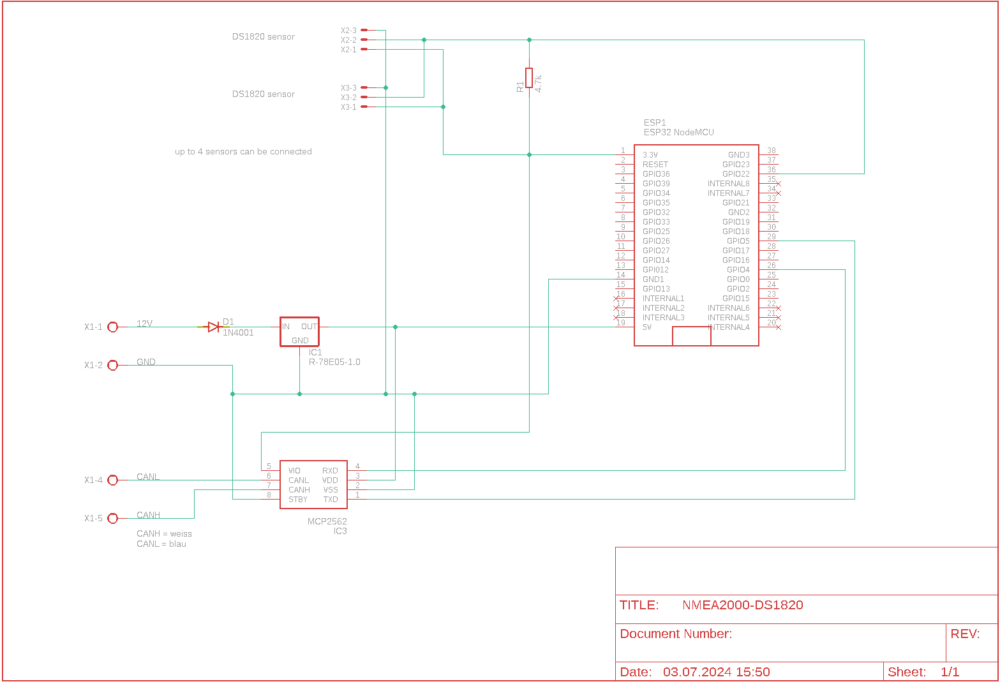
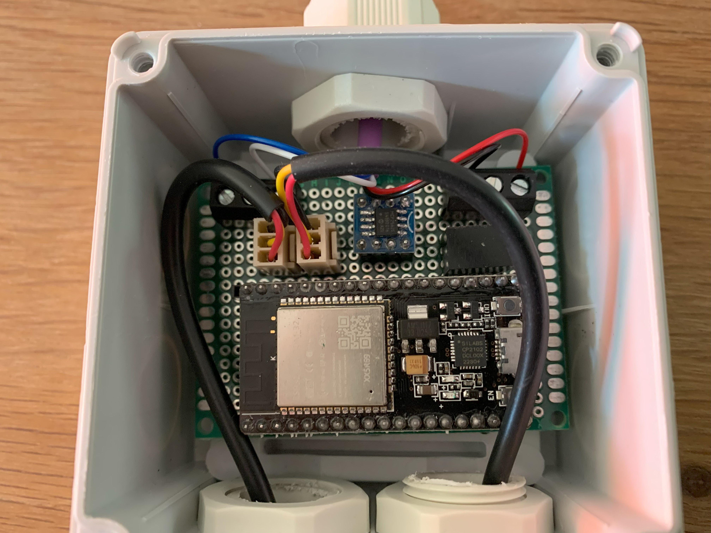

# NMEA2000-DS1820 Temperature Monitor

## Table of contents

- [NMEA2000-DS1820 Temperature Monitor](#nmea2000-ds1820-temperature-monitor)
	- [Table of contents](#table-of-contents)
	- [Description](#description)
	- [Features](#features)
	- [Schema](#schema)
	- [NMEA 2000](#nmea-2000)
	- [Libraries](#libraries)
	- [Part list](#part-list)
	- [Configuration](#configuration)
		- [System Configuration](#system-configuration)
			- [Thing name](#thing-name)
			- [AP password](#ap-password)
			- [WiFi SSID](#wifi-ssid)
			- [WiFi password](#wifi-password)
			- [AP offline mode after (minutes)](#ap-offline-mode-after-minutes)
		- [NMEA 2000 Settings](#nmea-2000-settings)
			- [Instance](#instance)
			- [SID](#sid)
		- [Sensor](#sensor)
			- [Source](#source)
			- [Threshold (°C)](#threshold-c)
			- [Method](#method)
			- [Alert Description](#alert-description)
			- [Temporary silence time (minutes)](#temporary-silence-time-minutes)
	- [Default Password](#default-password)
	- [Default IP address](#default-ip-address)
	- [Firmware Update](#firmware-update)
	- [Blinking codes](#blinking-codes)
	- [Reset](#reset)

## Description

A temperature sensor system that can accommodate up to 4 DS1820 sensors. Each sensor can be configured to measure temperature from -50°C (-58°F) up to 125°C (257°F). You can select the temperature source for each sensor (e.g., alternator, shaft seal, oil filter), and an alarm threshold can be set to trigger predefined alarms when the temperature exceeds the threshold. The system communicates via the NMEA 2000 protocol, sending temperature values and alarms as NMEA 2000 messages over an NMEA bus. Configuration is done through a web interface, and real-time values can be viewed on a website. Additionally, there's a link on the configuration page for convenient firmware updates.

## Features

- Supports up to 4 DS1820 temperature sensors
- Temperature range: -50°C to 125°C (-58°F to 257°F)
- NMEA 2000 compliant messaging
- Web-based configuration interface
- Real-time monitoring via web interface
- Configurable temperature alarms
- WiFi connectivity with access point fallback
- Over-the-air firmware updates
- Low power consumption monitoring
- Visual status indication via LED

## Schema

## NMEA 2000

Depending on the temperature source, one of the following PGNs are sent:

- 130310, // Environmental Parameters - DEPRECATED
- 130312, // Temperature - DEPRECATED
- 130316, // Temperature, Extended Range

The device is also capable of sending alerts. In this case these PGNs are used:

- 126983, // Alert
- 126984, // Alert response
- 126985, // Alert text

## Libraries

The Software has been created using Visual Studio with the addon Visual Micro. In order to build it you also need some libraries:

- [OneWire (2.3.7)](https://github.com/PaulStoffregen/OneWire)
- [DallasTemperature(3.9.0)](https://github.com/milesburton/Arduino-Temperature-Control-Library)
- [NMEA2000](https://github.com/ttlappalainen/NMEA2000)
- [NMEA200_ESP32](https://github.com/ttlappalainen/NMEA2000_esp32)
- [NMEA2000_AlertMessages](https://github.com/minou65/NMEA2000-AlertMessages)
- [AsyncTCP (3.2.6) *](https://github.com/ESP32Async/AsyncTCP)
- [ESPAsyncWebServer (3.3.12) *](https://github.com/ESP32Async/ESPAsyncWebServer)
- [Webserial (2.0.7) *](https://github.com/ayushsharma82/WebSerial)
- [IotWebConf](https://github.com/minou65/IotWebConf)
- [IotWebConfAsync (1.0.2) *](https://github.com/minou65/IotWebConfAsync)
- [IotWebRoot](https://github.com/minou65/IotWebRoot)

\* new version and/or new repo

## Part list

| Part | Value | Supplier |
| --- | --- | --- |
| D1 | 1N4001 | Reichelt |
| ESP1 | ESP32DEVKITV1 | [ebay](https://www.ebay.ch/itm/204191675506?var=504772734176) |
| IC1 | R-78E05-1.0 | Reichelt |
| IC2 | INA226 | [ebay](https://www.ebay.ch/itm/314750066199) |
| IC3 | MCP2562 | Reichelt oder [ebay](https://www.ebay.ch/itm/364610349378) |
| R1 | 4.7k | Reichelt |
| X1 | 2 x AKL 057-02 | Reichelt |
| X2 - X4 | PSS 254/3G | Reichelt |

Some pictures from the assembled hardware:

## Configuration

After the first boot, there are some values that need to be set up.
These items are marked with __*__ (star) in the list below.

### System Configuration

#### Thing name

Please change the name of the device to a name you think describes it the most. It is advised to incorporate a location here in case you are planning to set up multiple devices in the same area. You should only use english letters, and the "_" underscore character. Thus, must not use Space, dots, etc. E.g. `main_cabin` __*__

#### AP password

This password is used, when you want to access the device later on. You must provide a password with at least 8, at most 32 characters. You are free to use any characters, further more you are encouraged to pick a password at least 12 characters long containing at least 3 character classes. __*__

#### WiFi SSID

The name of the WiFi network you want the device to connect to. __*__

#### WiFi password

The password of the network above. Note, that unsecured passwords are not supported in your protection. __*__

#### AP offline mode after (minutes)

If you don't plan to connect the sensor to a WiFi network, you don't need to configure the two options above. If you want to disable the WiFi after a certain time, you can use this option. Specify how long the WiFi should remain enabled after turning on the sensor. Valid values are from 0 to 30 minutes. A value of 0 means that WiFi is always enabled.

### NMEA 2000 Settings

#### Instance

This should be unique at least on one device. May be best to have it unique over all devices sending this PGN. Depending on the number of sensors connected, between 1 and 4 instances are used, starting with the number set here. __*__

#### SID

Sequence identifier. In most cases you can use just 255 for SID. The sequence identifier field is used to tie different PGNs data together to same sampling or calculation time.

### Sensor

Depending on the number of sensors connected, the following settings can be made for each sensor.

#### Source

One of the following temperature sources can be selected:

- Sea water temperature
- Outside temperature
- Inside temperature
- Engine room temperature
- Main cabin temperature
- Live well temperature
- Bait well temperature
- Refrigeration temperature
- Heating system temperature
- Freezer temperature
- Exhaust gas temperature
- Shaft seal temperature

#### Threshold (°C)

Threshold in °C

#### Method

Method with which the threshold value is compared to the current value:

- equal
- lower than
- greater than

#### Alert Description

A description for the alarm

#### Temporary silence time (minutes)

This sensor supports the Temporary silence mode. With this parameter you can set the time how long the alert should be silent.

## Default Password

When not connected to an AP the default password is 123456789

## Default IP address

When in AP mode, the default IP address is 192.168.4.1

## Firmware Update

To update the firmware, navigate to the Configuration page and click on the Firmware Update link. Follow the on-screen instructions to complete the update process.

## Blinking codes

Previous chapters mentioned blinking patterns, now here is a table that summarizes the meaning of the blink codes.

| Blinking Pattern | Meaning |
| --- | --- |
| Rapid blinking (mostly on, interrupted by short off periods) | Entered Access Point mode. This means the device creates its own WiFi network. You can connect to the device with your smartphone or WiFi capable computer. |
| Alternating on/off blinking | Trying to connect to the configured WiFi network. |
| Mostly off with occasional short flash | The device is online. |
| Mostly off with occasional long flash | The device is in offline mode |

## Reset

When CONFIG_PIN is pulled to ground on startup, the Thing will use the initial password to build an AP. (E.g. in case of lost password)

Reset pin is GPIO 13
